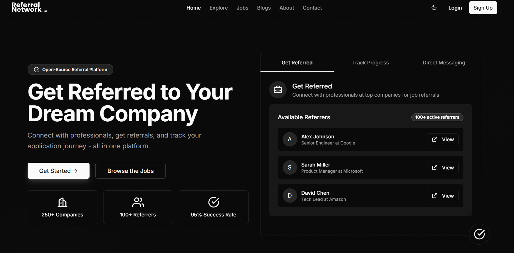

# Refernet



> Refernet is a full-stack web application designed to manage and streamline referrals, featuring a modern React frontend and a robust Node.js/Express backend with MongoDB for data storage.

## What is Refernet?

Refernet is a platform for managing referrals efficiently. It allows users to submit, track, and manage referrals through an intuitive web interface. The system is designed for scalability and ease of use, making it suitable for organizations or teams that rely on referral workflows.

---

## Key Features

- User-friendly React frontend
- RESTful API backend with Node.js/Express
- MongoDB database for persistent storage
- Modular codebase for easy maintenance
- Documentation and contribution guidelines

---

## 💻 Prerequisites

- Node.js (v14 or higher)
- npm (v6 or higher)
- MongoDB (local or cloud instance)
- Git

---

## 🚀 Installation

1. **Clone the repository:**
   ```bash
   git clone <your-repo-url>
   cd Refernet
   ```
2. **Install backend dependencies:**
   ```bash
   cd backend
   npm install
   ```
3. **Install frontend dependencies:**
   ```bash
   cd ../frontend
   npm install
   ```
4. **Set up environment variables:**
   - Create a `.env` file in the `backend/` directory with your MongoDB URI and any other required settings.
5. **Start MongoDB:**
   - Ensure your MongoDB server is running locally or use a cloud provider.
6. **Run the backend server:**
   ```bash
   cd ../backend
   npm run dev
   ```
7. **Run the frontend app:**
   ```bash
   cd ../frontend
   npm start
   ```

---

## ☕ Usage

- Access the frontend at [http://localhost:3000](http://localhost:3000)
- The backend API runs by default at [http://localhost:5000](http://localhost:5000) (configurable)
- Use the web interface to manage referrals

---

## 🛠️ Technology Stack

- **Frontend:** React, Material-UI, Axios, Notistack, React Router
- **Backend:** Node.js, Express, TypeScript, Mongoose, JWT, Joi
- **Database:** MongoDB
- **Dev Tools:** Nodemon, ESLint, Prettier

---

## 🏗️ File Structure

```
Refernet/
├── backend/                  # Node.js/Express backend
│   ├── src/                  # Backend source code
│   ├── package.json          # Backend dependencies
│   └── ...
├── frontend/                 # React frontend
│   ├── src/                  # Frontend source code
│   ├── package.json          # Frontend dependencies
│   └── ...
├── Documentation/            # Project documentation
│   ├── FLOWCHART.md          # Flowcharts and diagrams
│   └── ...
├── home-page.png             # Screenshot of the app
├── README.md                 # Project documentation
├── LICENSE                   # License file
└── ...
```

---

## 🤝 Contributors

<table>
  <tr>
    <td align="center">
      <a href="https://github.com/rahul-jaiswar-git" title="Rahul Jaiswar">
        <br>
        <sub>
          <b>Rahul Jaiswar</b>
        </sub>
      </a>
    </td>
  </tr>
</table>

---

## 📝 License

This project is licensed under the MIT License - see the [LICENSE](LICENSE) file for details.
